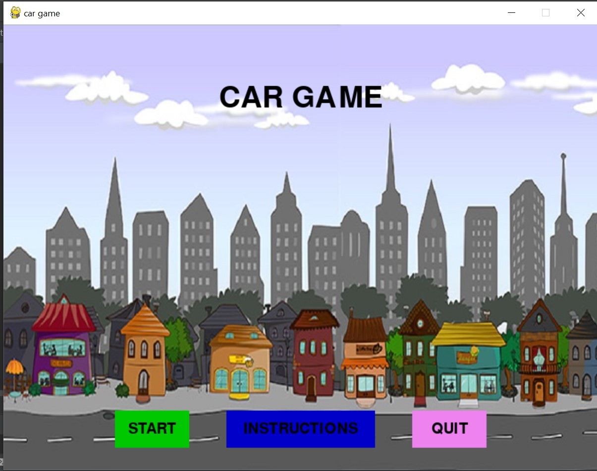
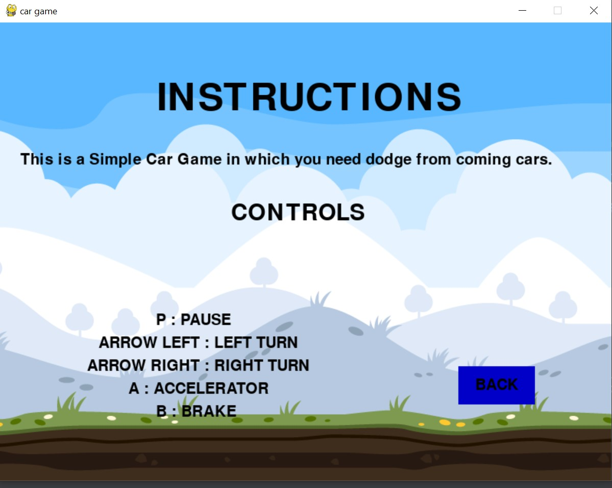
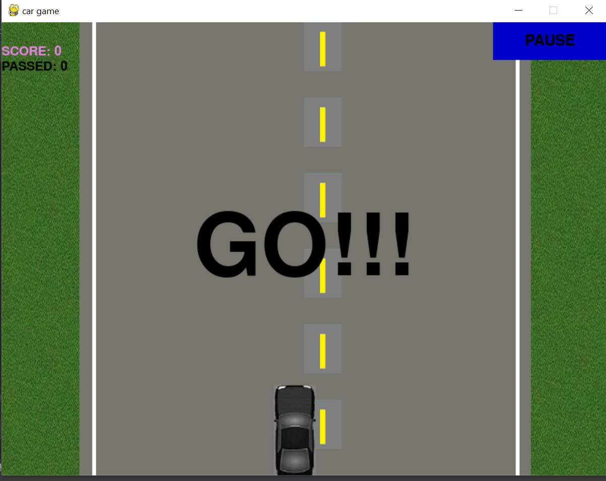
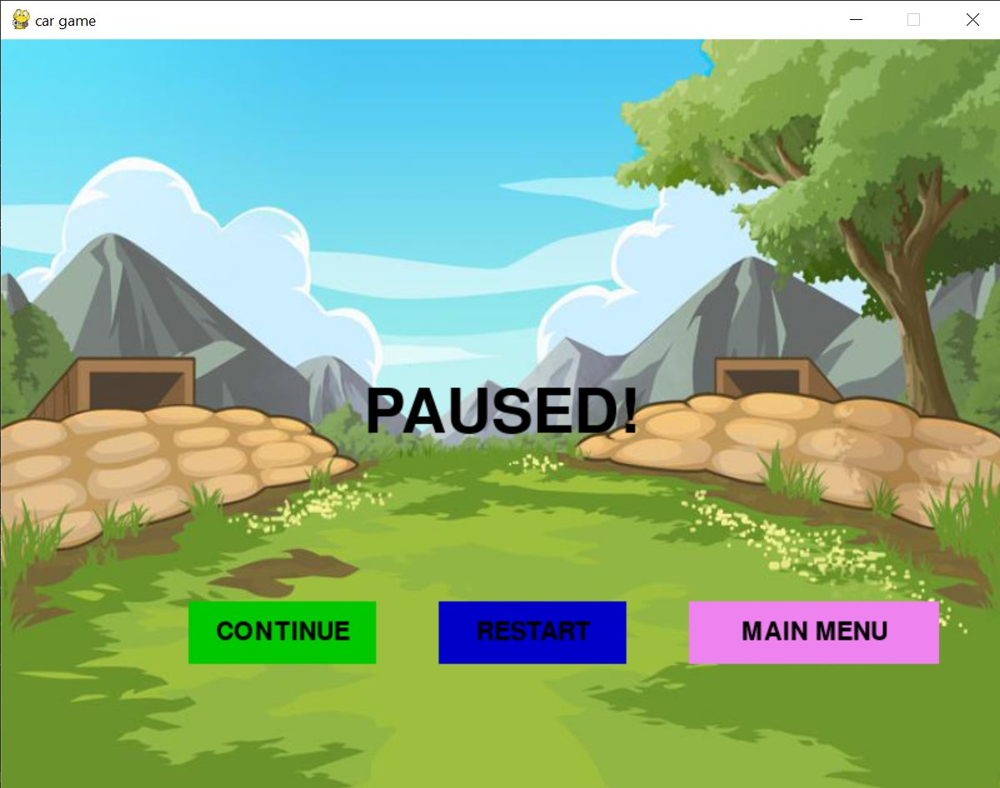
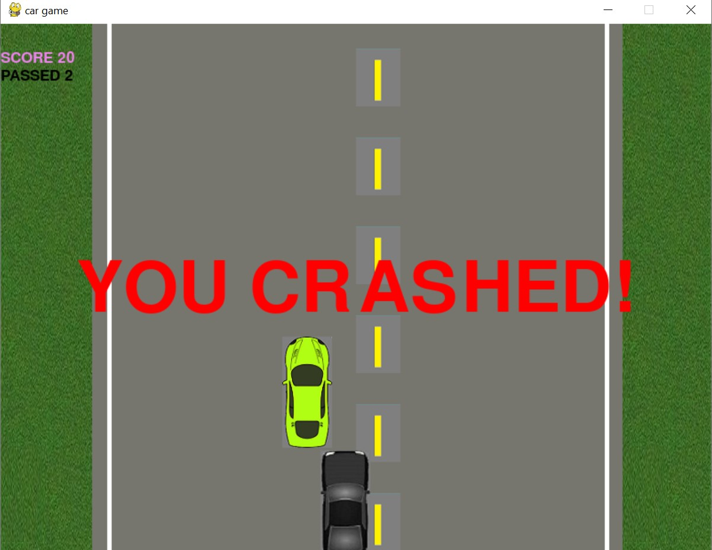
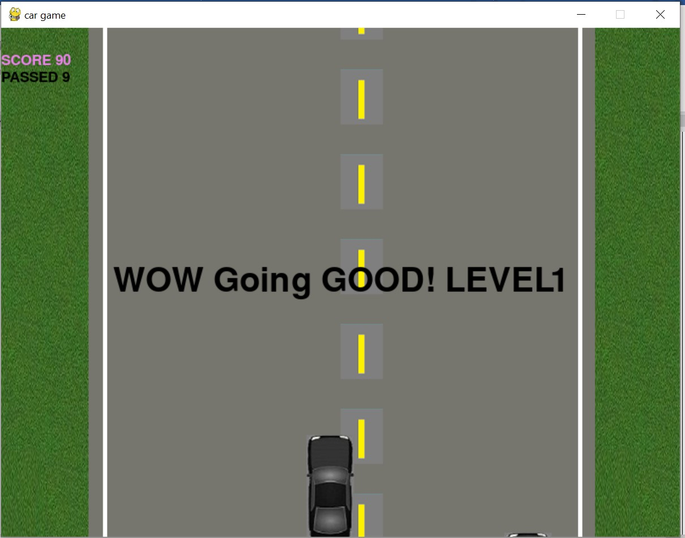
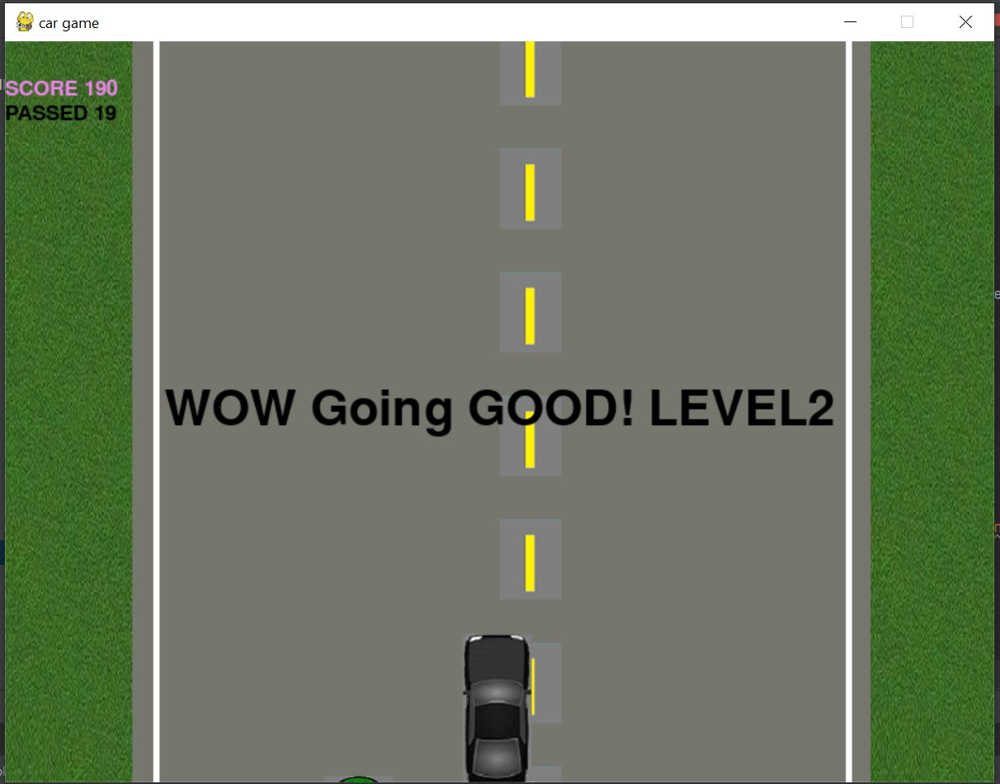

# Car Game
## Pygame module and a collection of various libraries is used for game development in Python. 
# Installation
1. Install PyCharm
2. Install pygame module
3. Import pygame
4. Import time module
5. Import random module
6. Import sys module
# Usage
- After importing the required modules, code is written in PyCharm.
- To create a instance for pygame library, pygame.init() method is used.
- Various images are added to the directory including background images, car images, road lanes, yellow strips, etc
- Event handling is done using mouse module, for example, arrow keys can be used to control the car
- Various buttons like START, INSTRUCTION, QUIT, PAUSE are added to achieve the user desired functionality.
- Time module is used for controlling the movement of the car, adding countdown timer at the beginning to highlight the time left for the game to start.
- Player can quit the game using QUIT button whose functionality is implemented using exit() method in sys module.
- As the level of the game increases, the speed of the enemy car increases and the highscore is updated.

# Images
## This the home screen where player can navigate through buttons.

## This is the instructions page where player can go through all the controls required to play the game.

## This is the screen when player clicks on Start button. The countdown timer starts from 3-2-1 and finally GO!

## This is the paused screen which appears after player clicks on Pause button. Player can resume the game or can restart the game or can move to the main menu.

## This is the screen which appears when player's car is crashed with the enemy car and the game stops here.

## This is the screen where player's level gets updated and speed of incoming car will also be increased.

## Here player's level gets updated from Level 1 to Level 2.

